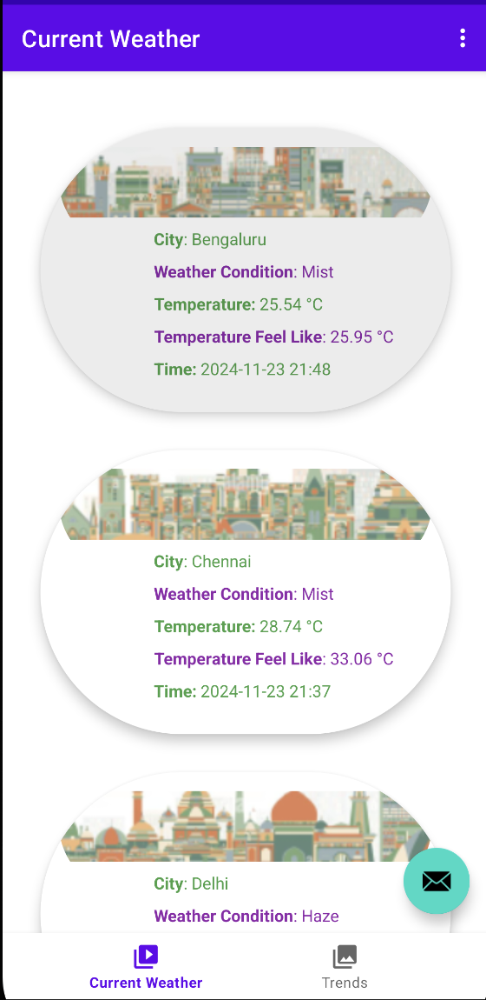
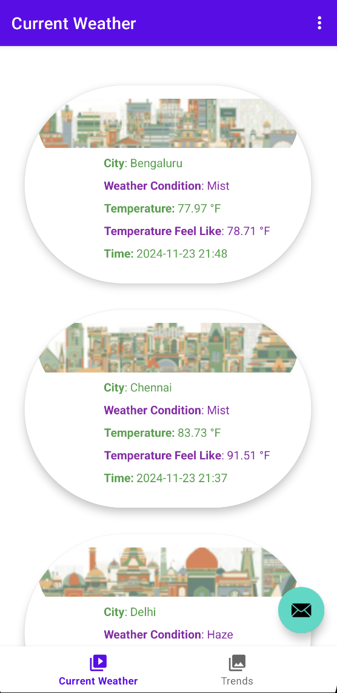
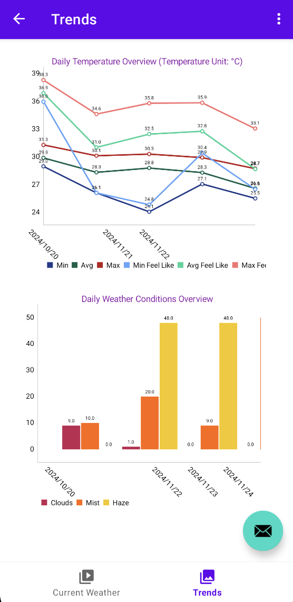
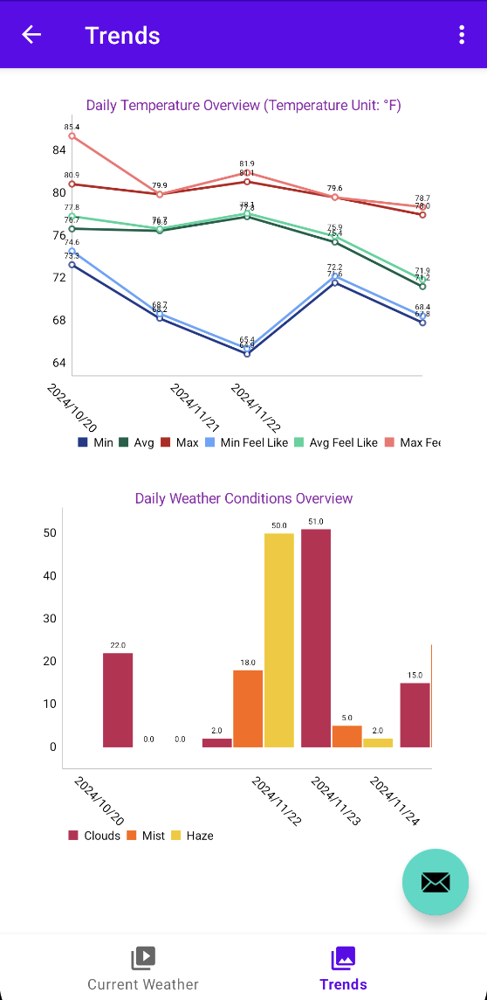
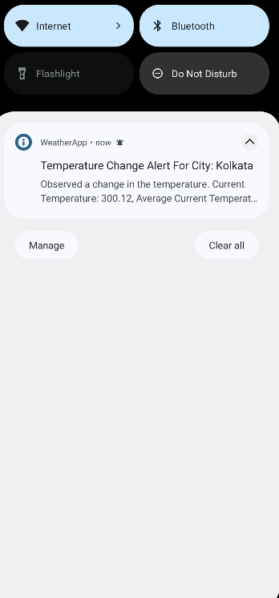
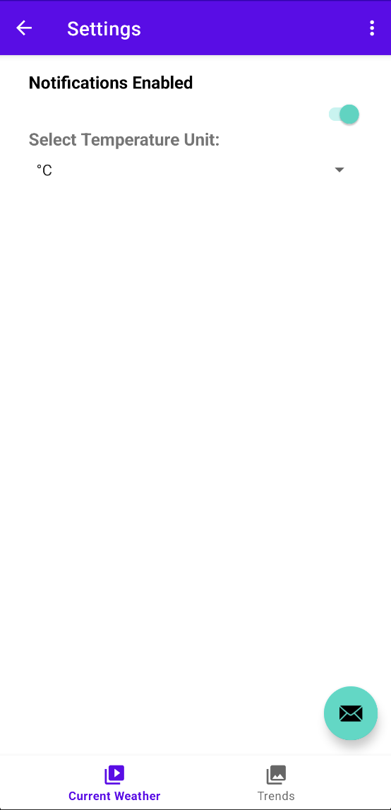

# Weather App

Welcome to the **Weather App**! This Android application provides comprehensive weather updates, trends, and insights for multiple cities, backed by data from the Open Weather Map API. The app leverages modern Android features like Content Providers, background threads, and SQLite database to deliver an efficient and customizable user experience.

---

## Features

### 1. **City-Specific Weather Updates**
   - **Current Weather Card**: Displays the latest weather data for each city, including:
     - City image.
     - Current weather conditions.
     - Temperature and "feels like" temperature.
     - Timestamp of the last data fetch.
   - Cities covered:
     - London
     - New York
     - Los Angeles
     - Tokyo
     - Mumbai
     - Delhi
     - Bengaluru
     - Chennai
     - Kolkata

### 2. **Data Storage and Aggregation**
   - Weather data fetched from the Open Weather Map API is stored in **Content Providers** backed by an **SQLite database**.
   - Background thread fetches data every **5 minutes** to ensure real-time updates.
   - Aggregated daily metrics are stored in a separate table, including:
     - Minimum, Maximum, and Average Temperatures.
     - Weather conditions with frequency count.

### 3. **Customizable Settings**
   - **Temperature Unit Settings**:
     - Choose between **Kelvin**, **Celsius**, or **Fahrenheit**.
     - All displayed data adheres to the user’s selected unit.
   - **Notification Settings**:
     - Enable/disable notifications for temperature changes.
     - Real-time alerts notify users of significant temperature fluctuations.

### 4. **Weather Trends and Visualization**
   - **Trends View**:
     - Daily level temperature insights (Min, Max, and Average).
     - Line charts for temperature trends over time.
   - **Weather Conditions Bar Graph**:
     - Visual representation of daily weather conditions and their frequencies.

---

## Technology Stack

- **Programming Language**: Kotlin
- **Data Fetching**: Open Weather Map API
- **Data Storage**: Content Providers + SQLite Database
- **Background Processing**: Thread for periodic data fetching
- **Notifications**: Local Android notifications
- **Charts**: MPAndroidChart library for data visualization

---

## How It Works

1. **Background Data Fetch**:
   - The app pulls data every 5 minutes for each city using a background thread.
   - Stores the fetched data in Content Providers for efficient access.

2. **Data Aggregation**:
   - Aggregated metrics for each city, such as min/max/avg temperatures and weather conditions, are calculated daily.

3. **User Notifications**:
   - Notifications are sent when there is a noticeable temperature change in any city.

4. **Custom Views**:
   - The app displays data in an intuitive and visually appealing manner, including weather cards, line charts, and bar graphs.

---

## Screenshots (Optional)

<div style="display: flex; justify-content: space-around;">

  
  
  
  
  
  
</div>

---

## Installation and Setup

1. Clone the repository:
   ```bash
   git clone https://github.com/yourusername/weather-app.git
   ```
2. Open the project in Android Studio.
3. Add your Open Weather Map API key to the configuration file.
4. Build and run the app on your Android device or emulator.

---

## Future Enhancements

- Add support for more cities.
- Add backend service to maintain user accounts and preferences.
- Provide weekly and monthly weather trends.
- Implement dark mode for better user experience.
- Introduce machine learning models for weather predictions.

---

## Contact

For any queries or suggestions, please reach out to:  
**Naman Pahwa** - [namanpahwa20@gmail.com](mailto:namanpahwa20@gmail.com)  
